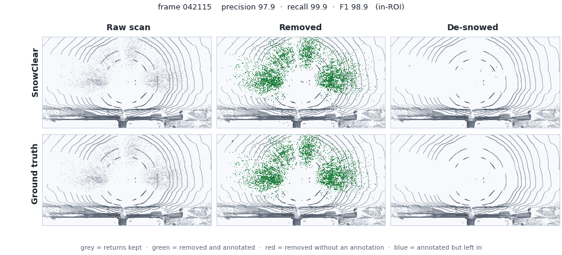
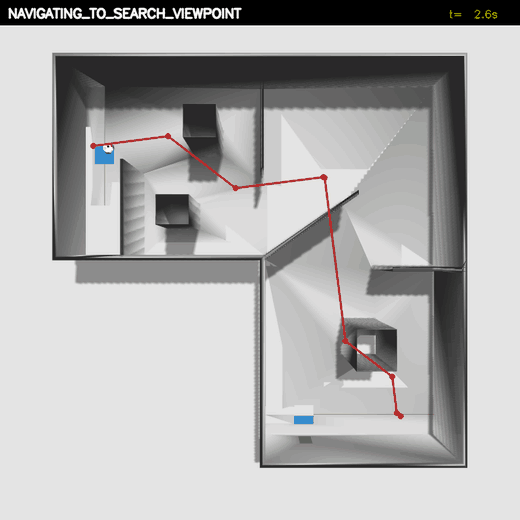
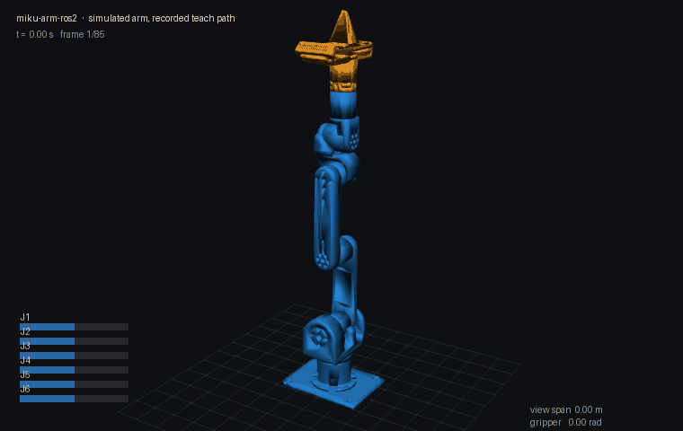
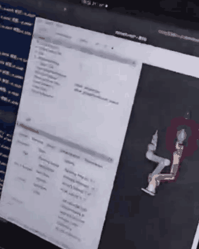

<h2>QuanQuan 🤖</h2>

Robotics: ROS 2, autonomous navigation, LiDAR point clouds, multi-robot coordination.

## Work

### RITS — training-free snow removal for spinning LiDAR

Point-wise snow detection and removal for spinning LiDAR, with no training and no learned weights.
16 scenes / 1 620 frames of WADS: **F1 92.8**. On the same 101 frames it matches CRFOR (Wang et al.,
RA-L 2023) on accuracy — F1 96.9 vs 96.4 — at **≈ 1 900×** its speed (9 ms vs 17 132 ms per frame).
Every timing here is CPU only, on a thin-and-light laptop (Huawei MateBook 14 2022, Intel Core
i5-1240P, `OMP_NUM_THREADS=2`). A ROS-free C++17 core with a byte-exact regression gate, and a ROS 2
node on top of it.

Paper in preparation; the reference implementation (`SnowClear`) is private for now.

### [Sim2Real-AlgoBench](https://github.com/p20030920p/Sim2Real-AlgoBench) — three-wheeled omnidirectional autonomy

A competition task: one start signal, then AMCL on a saved map, Nav2 planning to search viewpoints,
green-marker detection and the finish-pad approach. Seven global planners (Dijkstra, A\*, Weighted
A\*, GBFS, Theta\*, D\* Lite, JPS) sit behind one Nav2 plugin interface and are selected by one line
of config; every run writes a JSON report. Run to completion at the event on the physical vehicle;
the public repository is the simulation side of that stack.

### [miku-arm-ros2](https://github.com/p20030920p/miku-arm-ros2) — 6-axis arm control

ROS 2 driver and control stack for a 6-axis Damiao-motor arm: KDL inverse kinematics, MIT-mode
hand-guided teaching with gravity compensation, MoveIt 2 planning, and a protocol-level simulator
that runs the real driver binary against a virtual driver board — **13 checks pass with no hardware
attached**. The first clip is the simulator replaying a recorded teach path; the second is the real
self-built arm following a goal dragged in RViz.

<h2>我是 QuanQuan 🤖</h2>

机器人方向：ROS 2、自主导航、LiDAR 点云、多机器人调度。

## 项目

### RITS —— 旋转式 LiDAR 免训练去雪

逐点检测并去除雪点，无需训练、无学习权重。WADS 16 场景 / 1 620 帧，**F1 92.8**；在同一批 101 帧上
与 CRFOR（Wang et al., RA-L 2023）精度相当（F1 96.9 vs 96.4），速度快 **≈ 1 900 倍**
（9 ms vs 17 132 ms 每帧）。以上耗时均为纯 CPU、在一台轻薄本上测得（华为 MateBook 14 2022 款，
Intel Core i5-1240P，`OMP_NUM_THREADS=2`）。核心不依赖 ROS，带逐字节回归门禁，其上是一个 ROS 2 节点。

论文正在投稿中，参考实现（`SnowClear`）暂未公开。

### [Sim2Real-AlgoBench](https://github.com/p20030920p/Sim2Real-AlgoBench) —— 三轮全向机器人自主导航

来自一项综合性机器人比赛的任务：一次启动信号后，AMCL 在已有地图上定位、Nav2 规划并跟随搜索视点、
识别绿色标志并驶入终点区。七种全局规划器（Dijkstra、A\*、Weighted A\*、GBFS、Theta\*、D\* Lite、JPS）
挂在同一个 Nav2 插件接口之后，改一行配置即可切换；每次运行都会写出 JSON 报告。比赛中同一套栈在实车上
完赛，公开仓库是这套栈的仿真侧。

### [miku-arm-ros2](https://github.com/p20030920p/miku-arm-ros2) —— 六轴机械臂控制

六轴达妙电机机械臂的 ROS 2 驱动与控制栈：KDL 逆解、MIT 模式手动示教与重力补偿、MoveIt 2 规划，
以及一个协议级仿真器——让真实的驱动二进制对接虚拟驱动板，**13 项检查无需硬件即可通过**。
前一段是仿真回放录制的示教轨迹，后一段是实机（自制机械臂）跟随 RViz 中拖动的目标。
