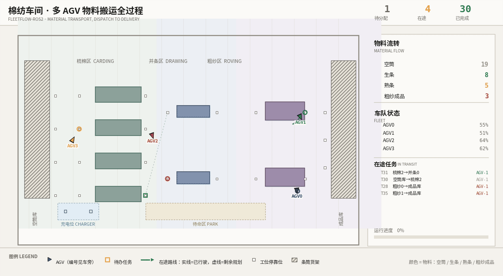

<h2>QuanQuan 🤖</h2>

Robotics: ROS 2, autonomous navigation, LiDAR point clouds, multi-robot coordination.

## Work

### SnowClear — training-free snow removal for spinning LiDAR

Point-wise snow detection and removal for spinning LiDAR. About 10 ms per frame on CPU, no training,
no learned weights.

### [Sim2Real-AlgoBench](https://github.com/p20030920p/Sim2Real-AlgoBench) — three-wheeled omnidirectional autonomy

Mapping, localization, planning and control for a three-wheeled omnidirectional robot in ROS 2 Jazzy
with Gazebo, including a nominal world and a stress world.

### [FleetFlow-ROS2](https://github.com/p20030920p/FleetFlow-ROS2) — multi-AGV material transport

Scheduling, traffic control and a live production board for a multi-AGV textile mill, ROS 2 Jazzy
with Gazebo.

### [miku-arm-ros2](https://github.com/p20030920p/miku-arm-ros2) — 6-axis arm control

ROS 2 driver and control stack for a 6-axis Damiao-motor arm, with a camera and ArUco-based picking.

## 项目

### SnowClear —— 旋转式 LiDAR 免训练去雪

逐点检测并去除雪点。纯 CPU 约 10 ms/帧，无需训练，无学习权重。

### [Sim2Real-AlgoBench](https://github.com/p20030920p/Sim2Real-AlgoBench) —— 三轮全向机器人自主性

ROS 2 Jazzy + Gazebo 下的建图、定位、规划与控制，含标称世界与压力世界。

### [FleetFlow-ROS2](https://github.com/p20030920p/FleetFlow-ROS2) —— 多 AGV 物料搬运

纺织厂多 AGV 的调度、交通管制与实时生产看板，ROS 2 Jazzy + Gazebo。

### [miku-arm-ros2](https://github.com/p20030920p/miku-arm-ros2) —— 六轴机械臂控制

六轴达妙电机机械臂的 ROS 2 驱动与控制栈，含相机与 ArUco 抓取。
