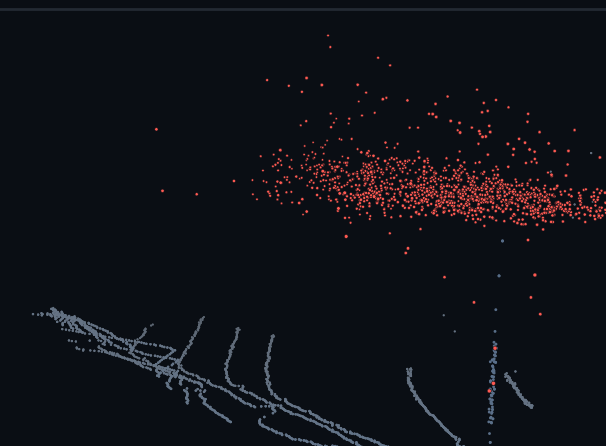
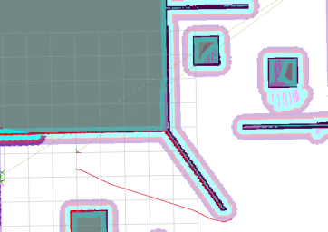
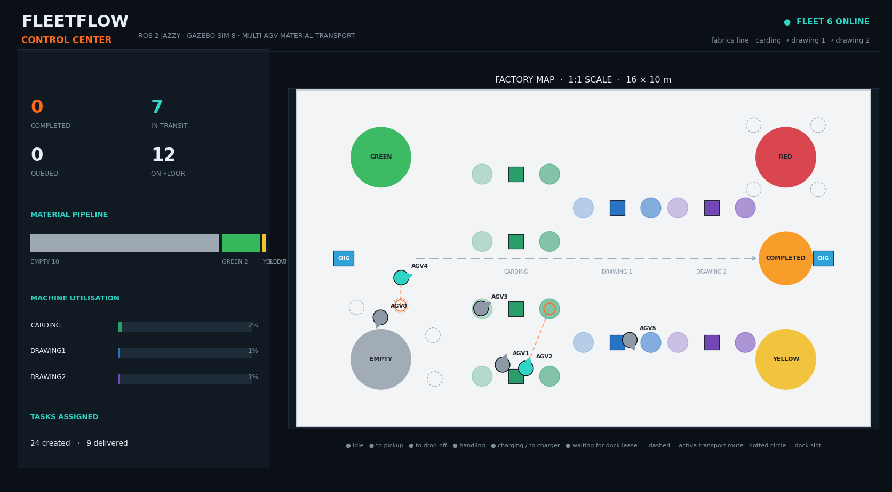
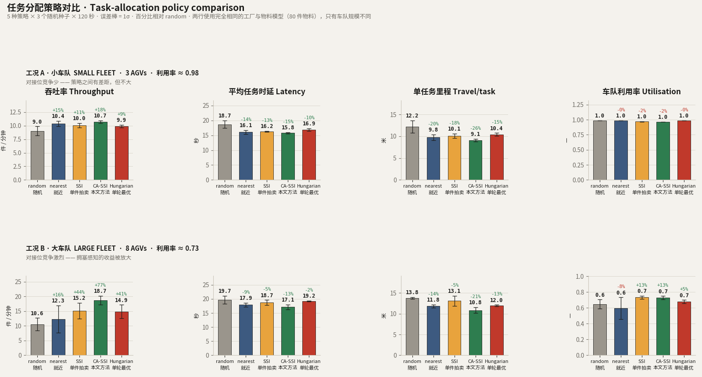

<h2> I'm QuanQuan 🤖</h2>

<em>Robotics learner — autonomous navigation, LiDAR point clouds, and multi-robot coordination. Mostly on ROS 2 Jazzy, with ROS 1 Noetic behind it.</em>

<i>Let's Connect:</i> 

**Languages and Tools:**

## Work

### [Sim2Real-AlgoBench](https://github.com/p20030920p/Sim2Real-AlgoBench) — three-wheeled omnidirectional autonomy benchmark

One fixed task, one fixed interface contract, one fixed metric set, evaluated twice: in simulation and on a physical robot. The robot gets one start signal, searches a known map for a green A4 marker on a wall, drives onto the yellow finish pad in front of it, and holds still for three seconds. No goal pose is published by hand — detection ends the run, not geometry.

  

- **Chassis** — three-wheeled omnidirectional drive, URDF/Xacro, LiDAR, camera, `ros2_control`
- **Localization** — SLAM Toolbox mapping, Nav2 Map Saver, AMCL against a prior grid map
- **Planning** — safe search viewpoints from the free-space connected component, then Theta\* any-angle global planning
- **Control** — MPPI `Omni`, with `/cmd_vel` arbitration that guarantees a single publisher
- **Worlds** — a nominal world and a stress world with moving obstacles, low traction, rough ground, and varying illumination

*ROS 2 Jazzy · Gazebo Sim 8 · C++17 / Python*

### [FleetFlow-ROS2](https://github.com/p20030920p/FleetFlow-ROS2) — multi-AGV material transport in a textile mill

  

A ROS 2 Jazzy + Gazebo Sim 8 fleet in which every AGV is a first-class robot — own namespace, own TF tree, own QoS class. Coordination is implemented rather than scripted: **dock leases** serialise access to stations and are structured so that hold-and-wait cannot arise, vehicles yield reciprocally and re-plan around moving peers, batteries drive charging trips, and a watchdog reclaims tasks from stalled vehicles.

The repository also carries a reproducible study of **multi-robot task allocation**. Five policies are scored on throughput, latency, travel per task and safety: random dispatch, nearest-neighbour, the standard distance-only sequential auction, **CA-SSI** — the same auction over a six-term industrial cost (deadhead, laden travel, dock contention, energy feasibility, load balance, task ageing) — and the Hungarian single-round optimum.

The finding is conditional, and I think that is the useful part: **allocation policy only matters when the fleet is the binding constraint.** With an over-provisioned fleet all five land within run-to-run noise — there is nothing to allocate, so nothing to win. When the fleet is saturated instead, CA-SSI delivers **+18 % throughput** over random dispatch and **10 % fewer metres per delivered task** than the distance-only auction it improves on, with the lowest mean task latency of the five. And the *mathematically optimal* single-round assignment still loses to it, because an optimal assignment is not the same thing as an optimal system.

  

*ROS 2 Jazzy · Gazebo Sim 8 · Python 3.12*

### SnowClear — training-free snow-point detection and removal for spinning LiDAR

  
  
  

*Private repository.* Point-wise removal of snowfall noise at frame rate, on CPU only: no training, no GPU, no learned weights. One raw frame in; a de-snowed cloud plus the snow indices out, kept in the coordinate and index space of the original input cloud. Around 10 ms per frame in a Release build, with byte-for-byte regression reproducibility — macro precision / recall / F1 **96.69 / 89.98 / 92.82** over the 16 released scenes — **2.4× the F1 of the best non-learned baseline** on the same 1 620 frames (SOR 37.93, DSOR 7.36, DROR 6.80, ROR 1.76) and two orders of magnitude faster than the radius-based ones. Re-mounting the sensor 0.9 m higher costs the released constants 24 pp of F1; the label-free self-calibration recovers all but 0.06 pp.

*ROS 2 Jazzy · C++17 · PCL*

### SLAM — mapping and navigation stack

*Private repository.* ROS 2 Jazzy + Gazebo Harmonic + `ros2_control` + SLAM Toolbox + a custom Nav2 A\* global planner, with a three-layer `ros2_control` architecture and scripted smoke tests.

### Earlier work

- **Snow_point** — the ROS 1 Noetic line of SnowClear: real-time, training-free, CPU-only LiDAR snow detection and removal.
- **Omnidirectional robot competition simulation** — three-wheeled omnidirectional chassis in Gazebo Classic 11 with SLAM, AMCL, `move_base`, DWA, green A4 detection, and an autonomous mission state machine. Validated in simulation; physical deployment still needs drive, odometry, and camera calibration work.

## Other repositories

| Repository | Language |
| --- | --- |
| [Mobile-Manupulator-Simulation-Test](https://github.com/p20030920p/Mobile-Manupulator-Simulation-Test) | Python |
| [Multi-RobotScheduling](https://github.com/p20030920p/Multi-RobotScheduling) | Python |
| [Factor_Simulation](https://github.com/p20030920p/Factor_Simulation) | Python |
| [Multy_Robot](https://github.com/p20030920p/Multy_Robot) | — |
| [RAS_CBS](https://github.com/p20030920p/RAS_CBS) | — |
| [RoboticManipulatorTest](https://github.com/p20030920p/RoboticManipulatorTest) | MATLAB |
| [ITMO-Summer-School-08.2025](https://github.com/p20030920p/ITMO-Summer-School-08.2025) | MATLAB |
| [Choose_wang](https://github.com/p20030920p/Choose_wang) | HTML |

## Working together

Open to collaboration on open-source robotics, point cloud processing, and multi-robot simulation and scheduling. Right now I'm working through point cloud acquisition, filtering, registration and feature extraction, multi-robot scheduling, and connecting large models to robot systems.

---

<h2> 我是 QuanQuan 🤖</h2>

<em>机器人技术学习者 —— 自主导航、LiDAR 点云处理与多机器人协同调度。主要用 ROS 2 Jazzy，也做过 ROS 1 Noetic。</em>

<i>联系我：</i> 

## 项目

### [Sim2Real-AlgoBench](https://github.com/p20030920p/Sim2Real-AlgoBench) —— 三轮全向机器人自主性基准

一个固定任务、一份固定接口契约、一套固定指标，评测两次：仿真一次，实车一次。机器人只收到一次启动信号，在已知地图里自主搜索墙上的绿色 A4 标记，驶入标记前的黄色终点垫并静止 3 秒。全程不手工下发目标点 —— 结束一次运行的是检测结果，而不是几何位置。

- **底盘** —— 三轮全向驱动、URDF/Xacro、LiDAR、相机、`ros2_control`
- **定位** —— SLAM Toolbox 建图、Nav2 Map Saver、在先验栅格地图上做 AMCL 定位
- **规划** —— 从起始位姿的自由空间连通域生成安全搜索视点，再用 Theta\* 做任意角全局规划
- **控制** —— MPPI `Omni` 局部控制，`/cmd_vel` 仲裁保证只有一个发布者
- **世界** —— 标称世界，以及带移动障碍、低附着区、粗糙地面与光照变化的压力世界

*ROS 2 Jazzy · Gazebo Sim 8 · C++17 / Python*

### [FleetFlow-ROS2](https://github.com/p20030920p/FleetFlow-ROS2) —— 纺织厂多 AGV 物料搬运仿真

  

跑在 ROS 2 Jazzy + Gazebo Sim 8 上的多机车队：每台 AGV 都是完整的一等机器人 —— 独立命名空间、独立 TF 树、按数据类别划分的 QoS。协同是**实现出来的而不是脚本化的**：**工位租约**把停靠串行化，并从结构上排除 hold-and-wait；车辆互相避让并绕开移动中的同伴重规划；电量驱动充电行程；看门狗回收卡死车辆的任务。

仓库里还带一组**可复现的多机器人任务分配（MRTA）研究**。五种策略按吞吐、时延、单任务里程与安全性打分：随机派单、最近邻、文献里标准的只认距离的顺序拍卖、**CA-SSI**（同一套拍卖，换成六项工业代价：空驶、载货、工位拥塞、电量可达、负载均衡、任务老化），以及匈牙利单轮最优解。

结论是一个条件句，我认为这才是有价值的部分：**只有当车队成为瓶颈时，分配策略才起作用。** 运力富裕时五种策略全部落在运行噪声里 —— 没有可分配的东西，也就没有可赢的东西。而当车队满负荷时，CA-SSI 相对随机派单吞吐 **+18%**，相对它所改进的"只认距离"拍卖**单任务里程少 10%**，平均时延在五种里最低。同时，**数学上单轮最优**的指派依然输给它 —— 最优的分配方案不等于最优的系统。

  

*ROS 2 Jazzy · Gazebo Sim 8 · Python 3.12*

### SnowClear —— 旋转式 LiDAR 的免训练雪点检测与去除

  
  
  

*私有仓库。* 逐点去除降雪噪声，帧率级速度，纯 CPU：不训练、不用 GPU、没有任何学习权重。输入一帧原始点云，输出去雪后的点云与被判为雪点的索引，且索引仍在原始输入点云的坐标系与索引空间中。Release 构建下约 10 ms/帧，逐字节回归可复现；16 个场景上的宏观精确率 / 召回率 / F1 为 **96.69 / 89.98 / 92.82**，是同一批 1 620 帧上**最好的非学习基线 F1 的 2.4 倍**（SOR 37.93、DSOR 7.36、DROR 6.80、ROR 1.76），且比基于半径的两者快两个数量级。安装高度抬高 0.9 m 会让发布常量丢掉 24 pp 的 F1，而无标注自标定只差 0.06 pp。

*ROS 2 Jazzy · C++17 · PCL*

### SLAM —— 建图导航全栈

*私有仓库。* ROS 2 Jazzy + Gazebo Harmonic + `ros2_control` + Slam Toolbox + 自定义 Nav2 A\* 全局规划器，配三层 `ros2_control` 架构与脚本化冒烟测试。

### 早前工作

- **Snow_point** —— SnowClear 的 ROS 1 Noetic 版本：实时、免训练、CPU-only 的 LiDAR 雪点检测与去除。
- **全向机器人竞赛仿真** —— Gazebo Classic 11 中的三轮全向底盘，含激光建图、AMCL、`move_base`、DWA、绿色 A4 识别与自动任务状态机。仿真已验证；装到实车仍需完成底盘驱动、里程计与相机内参标定。

## 合作

欢迎在开源机器人、点云处理、多机器人仿真与调度方向上合作。目前在推进点云采集/滤波/配准/特征提取、多机器人调度，以及大模型与机器人系统的结合。
