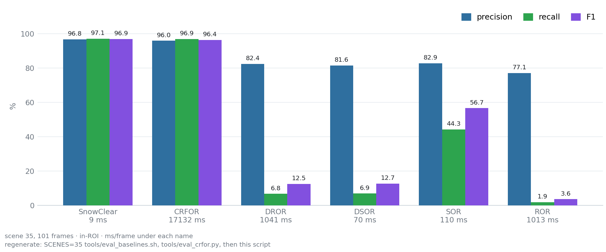

<h2> I'm QuanQuan 🤖</h2>

<em>Robotics learner — LiDAR point clouds, autonomous navigation, and multi-robot coordination. Mostly on ROS 2 Jazzy, with ROS 1 Noetic behind it.</em>

<i>Let's Connect:</i> 

**Languages and Tools:**

## Work

### [SnowClear](https://github.com/p20030920p/SnowClear) — training-free snow-point detection and removal for spinning LiDAR

  

Point-wise removal of snowfall noise at frame rate, on CPU only: no training, no GPU, no learned weights. One raw frame in; a de-snowed cloud plus the snow indices out, kept in the coordinate and index space of the original input cloud. Around 10 ms per frame in a Release build, with byte-for-byte regression reproducibility.

| | |
|---|---|
| **Accuracy** — 16 scenes, 1 620 frames | macro P 96.69 · R 89.98 · **F1 92.82** |
| **Against the best non-learned baseline** | **2.4×** its F1 (SOR 37.93, DSOR 7.36, DROR 6.80, ROR 1.76) |
| **Against CRFOR** (Wang et al., RA-L 2023) | F1 96.90 vs 96.41, at **9 ms vs 17 132 ms** per frame |
| **Sensor remounted 0.9 m higher** | released constants lose 24 pp of F1; label-free self-calibration loses 0.06 pp |

  
  

*ROS 2 Jazzy · C++17 · PCL*

### [Sim2Real-AlgoBench](https://github.com/p20030920p/Sim2Real-AlgoBench) — three-wheeled omnidirectional autonomy benchmark

  

One fixed task, one fixed interface contract, one fixed metric set, evaluated twice: in simulation and on a physical robot. The robot gets one start signal, searches a known map for a green A4 marker on a wall, drives onto the yellow finish pad in front of it, and holds still for three seconds. No goal pose is published by hand — detection ends the run, not geometry.

- **Chassis** — three-wheeled omnidirectional drive, URDF/Xacro, LiDAR, camera, `ros2_control`
- **Localization** — SLAM Toolbox mapping, Nav2 Map Saver, AMCL against a prior grid map
- **Planning** — safe search viewpoints from the free-space connected component, then Theta\* any-angle global planning
- **Control** — MPPI `Omni`, with `/cmd_vel` arbitration that guarantees a single publisher
- **Worlds** — a nominal world and a stress world with moving obstacles, low traction, rough ground, and varying illumination
- **Algorithms** — 7 registered planner/controller plugins behind one interface contract

*ROS 2 Jazzy · Gazebo Sim 8 · C++17 / Python*

### [miku-arm-ros2](https://github.com/p20030920p/miku-arm-ros2) — 6-axis Damiao-motor arm with a gripper, on ROS 2 Jazzy

  

Six Damiao motors and a gripper on one MCU board, driven over `/dev/ttyACM0` at 115200 with a 50-byte down / 46-byte up binary protocol. The controller runs its own KDL forward and inverse kinematics and straight-line interpolation and commands the motors in MIT mode — no MoveIt, no `ros2_control` — so the whole stack closes in simulation with no hardware attached.

- **Control** — KDL FK/IK, straight-line Cartesian interpolation, six-channel gravity compensation, 4-state gripper FSM
- **Modes** — `mode=1` MIT (stiffness, damping, torque feed-forward) · `mode=2` velocity-limited position
- **Teaching** — hand-guided at `kp=0`, recorded to a file, replayed through the same node
- **Perception** — ArUco detection and RealSense RGB-D on the vision-guided grasp path
- **No hardware needed** — simulated motors plus a protocol-level driver-board peer behind a `socat` PTY, so the real `hardware` binary is what gets tested

**7/7 serial-protocol checks and 6/6 control-pipeline checks pass**: joint setpoints accurate to under 0.002 rad, gravity droop cancelled by torque feed-forward, the gripper stalling on contact, a 7 325-point recorded trajectory replaying at 100 Hz, and the node surviving the board being unplugged mid-run.

*ROS 2 Jazzy · C++17 · KDL · OpenCV ArUco*

### [FleetFlow-ROS2](https://github.com/p20030920p/FleetFlow-ROS2) — multi-AGV material transport in a textile mill

  

A ROS 2 Jazzy + Gazebo Sim 8 fleet in which every AGV is a first-class robot — own namespace, own TF tree, own QoS class. Coordination is implemented rather than scripted: **dock leases** serialise access to stations and are structured so that hold-and-wait cannot arise, vehicles yield reciprocally and re-plan around moving peers, batteries drive charging trips, and a watchdog reclaims tasks from stalled vehicles.

The repository also carries a reproducible study of **multi-robot task allocation**. Five policies are scored on throughput, latency, travel per task and safety: random dispatch, nearest-neighbour, the standard distance-only sequential auction, **CA-SSI** — the same auction over a six-term industrial cost (deadhead, laden travel, dock contention, energy feasibility, load balance, task ageing) — and the Hungarian single-round optimum.

The finding is conditional, and I think that is the useful part: **allocation policy only matters when the fleet is the binding constraint.** With an over-provisioned fleet all five land within run-to-run noise — there is nothing to allocate, so nothing to win. When the fleet is saturated instead, CA-SSI delivers **+18 % throughput** over random dispatch and **10 % fewer metres per delivered task** than the distance-only auction it improves on, with the lowest mean task latency of the five. And the *mathematically optimal* single-round assignment still loses to it, because an optimal assignment is not the same thing as an optimal system.

  

*ROS 2 Jazzy · Gazebo Sim 8 · Python 3.12*

### Earlier work

- **SLAM** — ROS 2 Jazzy + Gazebo Harmonic + `ros2_control` + SLAM Toolbox + a custom Nav2 A\* global planner, with a three-layer `ros2_control` architecture and scripted smoke tests. *Private repository.*
- **Snow_point** — the ROS 1 Noetic line of SnowClear: real-time, training-free, CPU-only LiDAR snow detection and removal.
- **Omnidirectional robot competition simulation** — three-wheeled omnidirectional chassis in Gazebo Classic 11 with SLAM, AMCL, `move_base`, DWA, green A4 detection, and an autonomous mission state machine. Validated in simulation; physical deployment still needs drive, odometry, and camera calibration work.

## Working together

Open to collaboration on open-source robotics, point cloud processing, and multi-robot simulation and scheduling. Right now I'm working through point cloud acquisition, filtering, registration and feature extraction, robot arm dynamics, multi-robot scheduling, and connecting large models to robot systems.

---

<h2> 我是 QuanQuan 🤖</h2>

<em>机器人技术学习者 —— LiDAR 点云处理、自主导航与多机器人协同调度。主要用 ROS 2 Jazzy，也做过 ROS 1 Noetic。</em>

<i>联系我：</i> 

## 项目

### [SnowClear](https://github.com/p20030920p/SnowClear) —— 旋转式 LiDAR 的免训练雪点检测与去除

  

逐点去除降雪噪声，帧率级速度，纯 CPU：不训练、不用 GPU、没有任何学习权重。输入一帧原始点云，输出去雪后的点云与被判为雪点的索引，且索引仍在原始输入点云的坐标系与索引空间中。Release 构建下约 10 ms/帧，逐字节回归可复现。

| | |
|---|---|
| **精度** —— 16 个场景、1 620 帧 | 宏观 P 96.69 · R 89.98 · **F1 92.82** |
| **对比最好的非学习基线** | 其 F1 的 **2.4 倍**（SOR 37.93、DSOR 7.36、DROR 6.80、ROR 1.76） |
| **对比 CRFOR**（Wang et al., RA-L 2023） | F1 96.90 对 96.41，单帧 **9 ms 对 17 132 ms** |
| **传感器抬高 0.9 m 重装** | 发布常量丢掉 24 pp 的 F1；无标注自标定只丢 0.06 pp |

  
  

*ROS 2 Jazzy · C++17 · PCL*

### [Sim2Real-AlgoBench](https://github.com/p20030920p/Sim2Real-AlgoBench) —— 三轮全向机器人自主性基准

  

一个固定任务、一份固定接口契约、一套固定指标，评测两次：仿真一次，实车一次。机器人只收到一次启动信号，在已知地图里自主搜索墙上的绿色 A4 标记，驶入标记前的黄色终点垫并静止 3 秒。全程不手工下发目标点 —— 结束一次运行的是检测结果，而不是几何位置。

- **底盘** —— 三轮全向驱动、URDF/Xacro、LiDAR、相机、`ros2_control`
- **定位** —— SLAM Toolbox 建图、Nav2 Map Saver、在先验栅格地图上做 AMCL 定位
- **规划** —— 从起始位姿的自由空间连通域生成安全搜索视点，再用 Theta\* 做任意角全局规划
- **控制** —— MPPI `Omni` 局部控制，`/cmd_vel` 仲裁保证只有一个发布者
- **世界** —— 标称世界，以及带移动障碍、低附着区、粗糙地面与光照变化的压力世界
- **算法** —— 7 个规划 / 控制插件，注册在同一份接口契约下

*ROS 2 Jazzy · Gazebo Sim 8 · C++17 / Python*

### [miku-arm-ros2](https://github.com/p20030920p/miku-arm-ros2) —— 达妙电机六轴机械臂（含夹爪），ROS 2 Jazzy

  

六个达妙电机加一个夹爪挂在同一块 MCU 驱动板上，经 `/dev/ttyACM0` 以 115200、「下行 50 字节 / 上行 46 字节」的二进制协议通信。控制器自己跑 KDL 正逆运动学与直线插补，以 MIT 模式下发电机指令 —— 不经过 MoveIt，也不经过 `ros2_control` —— 因此整条链路在没有实机的情况下也能在仿真里闭环。

- **控制** —— KDL 正逆解、直线插补、六通道重力补偿、四态夹爪状态机
- **模式** —— `mode=1` MIT（刚度、阻尼、力矩前馈）· `mode=2` 限速位置控制
- **示教** —— `kp=0` 手动拖动，录制到文件，再由同一个节点复现
- **感知** —— ArUco 识别与 RealSense RGB-D，构成视觉引导抓取路径
- **无需实机** —— 仿真电机，外加一个跑在 `socat` PTY 背后的协议级虚拟驱动板，被测对象是真实的 `hardware` 二进制

**串口协议 7/7 项、控制链路 6/6 项全部通过**：关节定位精度优于 0.002 rad，重力下垂被力矩前馈抵消，夹爪接触后卡住，7 325 点录制轨迹以 100 Hz 复现，运行中拔掉驱动板节点不退出。

*ROS 2 Jazzy · C++17 · KDL · OpenCV ArUco*

### [FleetFlow-ROS2](https://github.com/p20030920p/FleetFlow-ROS2) —— 纺织厂多 AGV 物料搬运仿真

  

跑在 ROS 2 Jazzy + Gazebo Sim 8 上的多机车队：每台 AGV 都是完整的一等机器人 —— 独立命名空间、独立 TF 树、按数据类别划分的 QoS。协同是**实现出来的而不是脚本化的**：**工位租约**把停靠串行化，并从结构上排除 hold-and-wait；车辆互相避让并绕开移动中的同伴重规划；电量驱动充电行程；看门狗回收卡死车辆的任务。

仓库里还带一组**可复现的多机器人任务分配（MRTA）研究**。五种策略按吞吐、时延、单任务里程与安全性打分：随机派单、最近邻、文献里标准的只认距离的顺序拍卖、**CA-SSI**（同一套拍卖，换成六项工业代价：空驶、载货、工位拥塞、电量可达、负载均衡、任务老化），以及匈牙利单轮最优解。

结论是一个条件句，我认为这才是有价值的部分：**只有当车队成为瓶颈时，分配策略才起作用。** 运力富裕时五种策略全部落在运行噪声里 —— 没有可分配的东西，也就没有可赢的东西。而当车队满负荷时，CA-SSI 相对随机派单吞吐 **+18%**，相对它所改进的“只认距离”拍卖**单任务里程少 10%**，平均时延在五种里最低。同时，**数学上单轮最优**的指派依然输给它 —— 最优的分配方案不等于最优的系统。

  

*ROS 2 Jazzy · Gazebo Sim 8 · Python 3.12*

## 合作

欢迎在开源机器人、点云处理、多机器人仿真与调度方向上合作。目前在推进点云采集/滤波/配准/特征提取、机械臂动力学、多机器人调度，以及大模型与机器人系统的结合。
